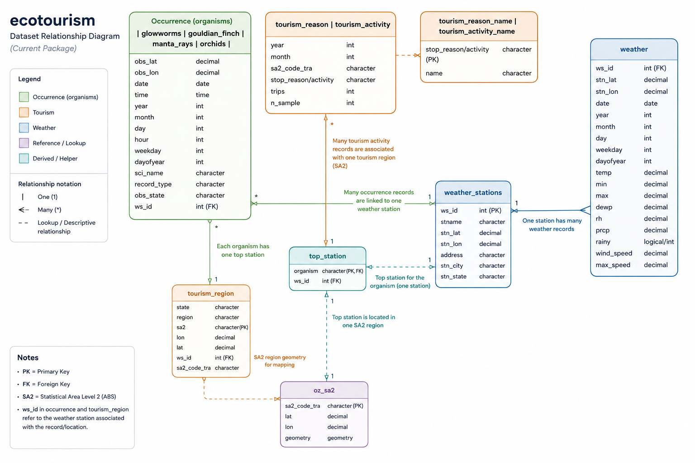

# Getting Started with the ecotourism Package

## 1 👋 Welcome

The **ecotourism** package provides tools to analyze ecological
observation data alongside weather conditions. This guide will help you
get started with the package and direct you to detailed vignettes for
specific organisms and workflows.

------------------------------------------------------------------------

## 2 🧭 What You Can Do

Analyze observation records for various species with tools to:

- 📍 Identify top observation sites  
- 🌦️ Integrate environmental data from nearby weather stations  
- 🗺️ Visualize spatiotemporal patterns

------------------------------------------------------------------------

## 3 🧪 Organism-Specific Workflows

Explore vignettes dedicated to individual species:

- 🔦 [Glowworms
  Observations](https://vahdatjavad.github.io/ecotourism/articles/glowworms.md)  
- 🐦 [Gouldian Finch
  Observations](https://vahdatjavad.github.io/ecotourism/articles/gouldian_finch.md)  
- 🐠 [Manta Rays
  Observations](https://vahdatjavad.github.io/ecotourism/articles/manta_rays.md)  
- 🌸 [Orchids
  Observations](https://vahdatjavad.github.io/ecotourism/articles/orchids.md)

Each vignette covers:

- Data cleaning and wrangling  
- Mapping and temporal summaries  
- Top station selection

------------------------------------------------------------------------

## 4 🌤️ Weather Integration

Combine ecological observations with environmental data:

- 📊 [**Weather Data
  Workflow**](https://vahdatjavad.github.io/ecotourism/articles/weather_data.md)  
  Join species data with daily weather from nearby stations.

- 🗺️ [**Weather Station
  Metadata**](https://vahdatjavad.github.io/ecotourism/articles/weather_stations.md)  
  View coordinates and metadata for weather stations used in analysis.

------------------------------------------------------------------------

## 5 ️ Tourism Data

- 📊 [**Tourism
  Data**](https://vahdatjavad.github.io/ecotourism/articles/tourism.md)  

------------------------------------------------------------------------

## 6 🚀 Get Started

To begin, choose an organism above or dive into the weather data tools
to enrich your analyses. The `ecotourism` package makes it easy to
explore interactions between biodiversity and climate in Australia.
