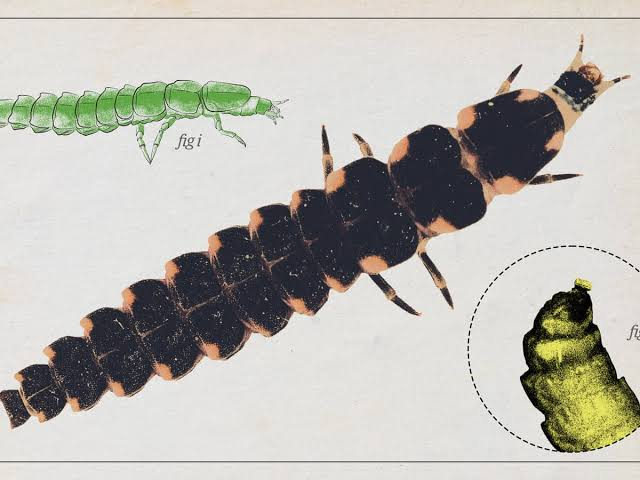
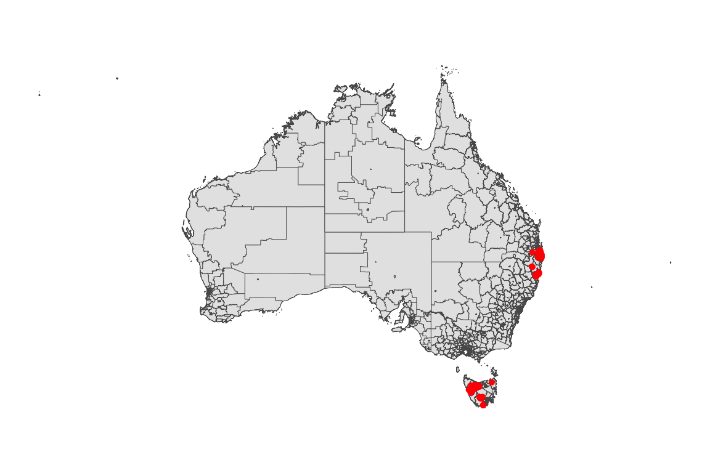
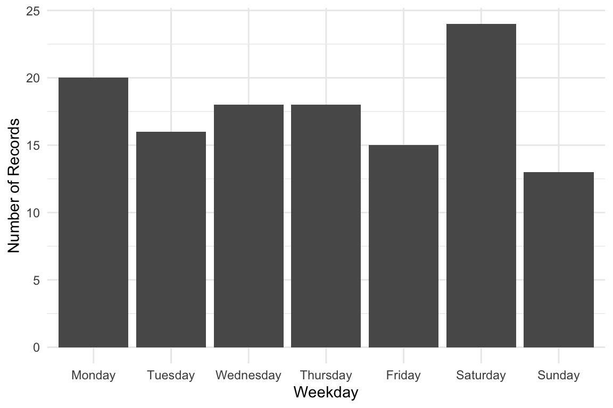
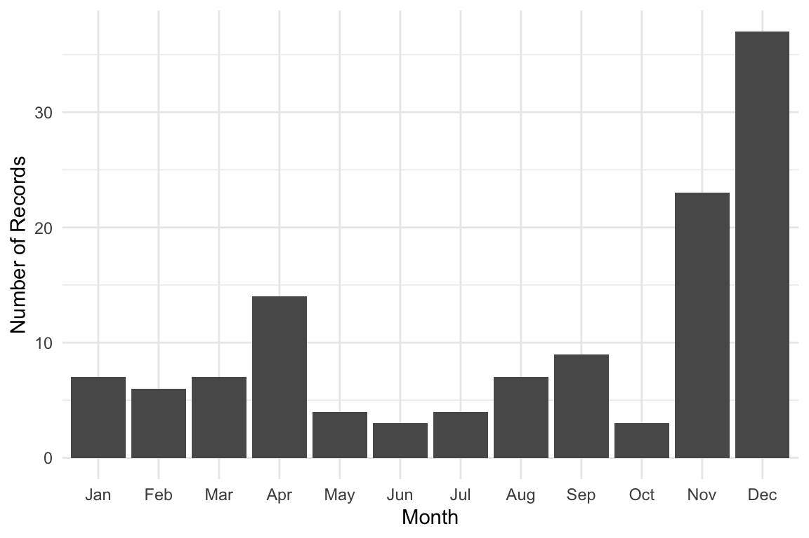
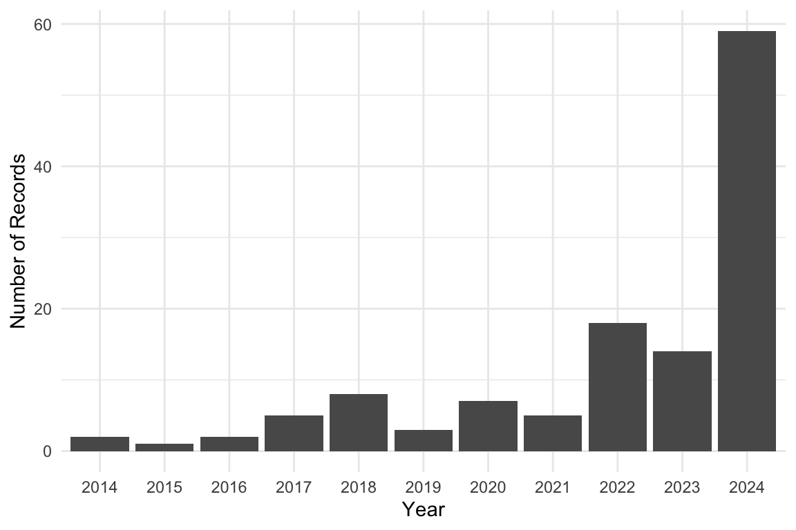

# Glowworms



Photo by Alan Rockefeller. Licensed under [CC BY
4.0](https://creativecommons.org/licenses/by/4.0/).

## 1 Introduction

This vignette demonstrates how to **analyze occurrence data for
Glowworms in Australia**, using records from the [Atlas of Living
Australia (ALA)](https://www.ala.org.au/).

The dataset has been prepared for you to explore, making it suitable for
both study and practice with real-world ecological data. In this
vignette we provide short examples of how to manipulate and visualize
the dataset, but you are encouraged to develop your own creative
approaches for analysis and visualization.

------------------------------------------------------------------------

This is the glimpse of your data :

``` r

library(dplyr)
library(ecotourism)
data("glowworms")
data("oz_sa2", package = "ecotourism")
glowworms |> glimpse()
```

    Rows: 124
    Columns: 14
    $ obs_lat     <dbl> -43.46398, -43.46257, -43.46228, -43.46207, -43.46201, -42…
    $ obs_lon     <dbl> 146.8676, 146.8485, 146.8490, 146.8491, 146.8476, 146.5577…
    $ date        <date> 2021-12-14, 2015-12-09, 2017-04-17, 2023-12-21, 2022-12-2…
    $ time        <chr> "22:14:23", "15:00:24", "13:31:00", "14:18:00", "18:42:12"…
    $ year        <dbl> 2021, 2015, 2017, 2023, 2022, 2024, 2024, 2024, 2024, 2018…
    $ month       <dbl> 12, 12, 4, 12, 12, 12, 12, 12, 12, 11, 12, 12, 12, 12, 12,…
    $ day         <dbl> 14, 9, 17, 21, 26, 5, 5, 5, 4, 28, 4, 5, 5, 6, 5, 4, 2, 2,…
    $ hour        <int> 22, 15, 13, 14, 18, 11, 11, 11, 23, 6, 22, 16, 16, 21, 11,…
    $ weekday     <ord> Tuesday, Wednesday, Monday, Thursday, Monday, Thursday, Th…
    $ dayofyear   <dbl> 348, 343, 107, 355, 360, 340, 340, 340, 339, 332, 339, 340…
    $ sci_name    <chr> "Arachnocampa tasmaniensis", "Arachnocampa tasmaniensis", …
    $ record_type <chr> "HUMAN_OBSERVATION", "HUMAN_OBSERVATION", "HUMAN_OBSERVATI…
    $ obs_state   <chr> "Tasmania", "Tasmania", "Tasmania", "Tasmania", "Tasmania"…
    $ ws_id       <chr> "949610-99999", "949610-99999", "949610-99999", "949610-99…

## 2 Visualization

### 2.1 Spatial Distribution Map

Distribution of Occurrence Glowworms Sightings in Australia

``` r

library(ggplot2)
library(ggthemes)

glowworms |> 
  ggplot() +
    geom_sf(data = oz_sa2) +
    geom_point(aes(x = obs_lon, y = obs_lat), color = "red") +
    theme_map()
```



------------------------------------------------------------------------

## 3 Weekly, Monthly, and Yearly Trends

Weekday Distribution of Glowworms Sightings

``` r

week_order <- c("Monday", "Tuesday", "Wednesday", "Thursday", "Friday", "Saturday", "Sunday")

glowworms |> 
  ggplot(aes(x = factor(weekday, levels = week_order))) +
    geom_bar() +
    labs(x = "Weekday", y = "Number of Records") +
    theme_minimal()
```



Monthly Distribution of Glowworms Sightings

``` r

library(lubridate)
glowworms |>
    dplyr::mutate(month = month(month, label = TRUE, abbr = TRUE)) |>
    ggplot(aes(x = factor(month))) +
    geom_bar() +
    labs(x = "Month", y = "Number of Records") +
    theme_minimal()
```



Yearly Distribution of Glowworms Sightings

``` r

glowworms |>
    ggplot(aes(x = factor(year))) +
    geom_bar() +
    labs(x = "Year", y = "Number of Records")+
    theme_minimal()
```


