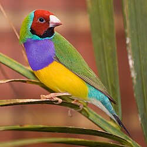
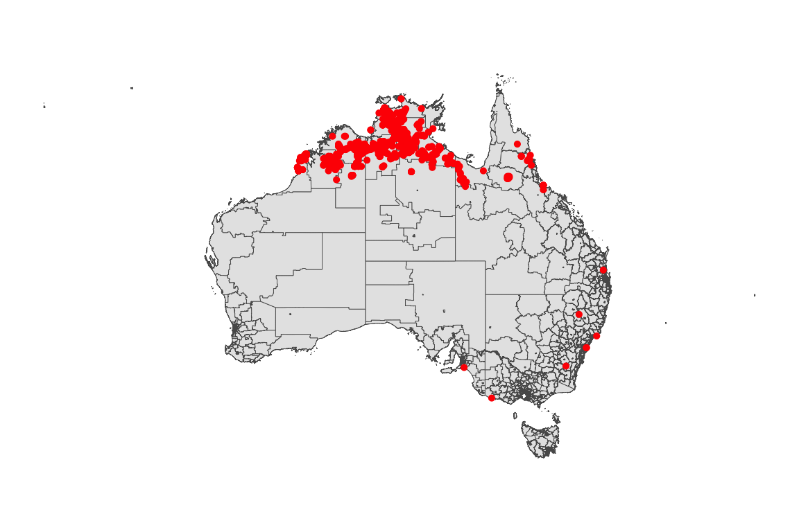
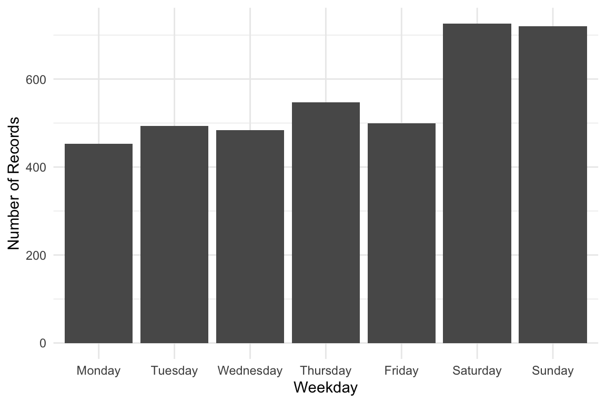
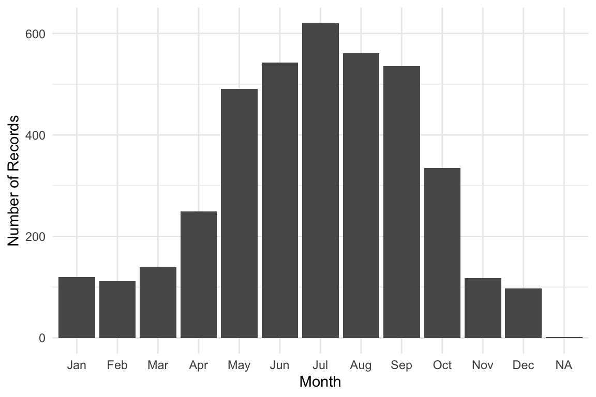
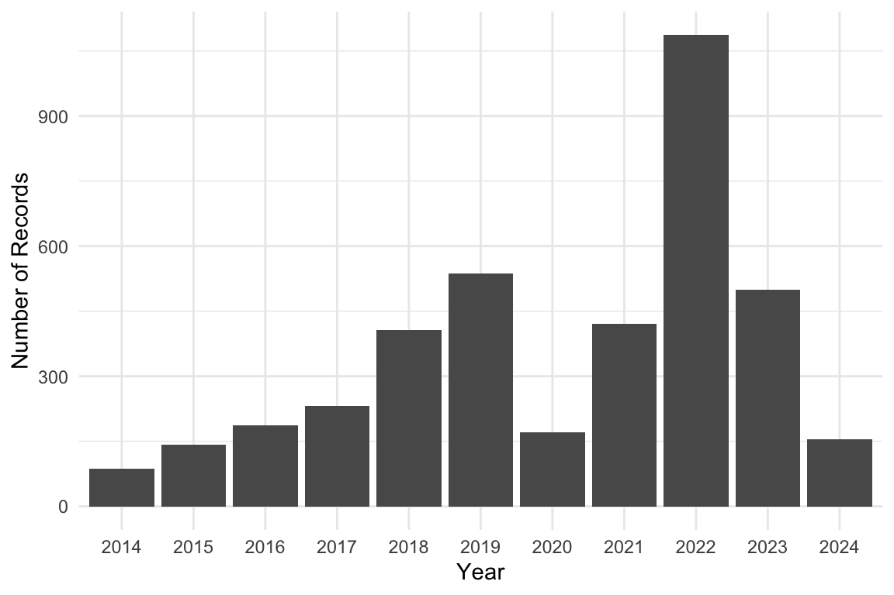
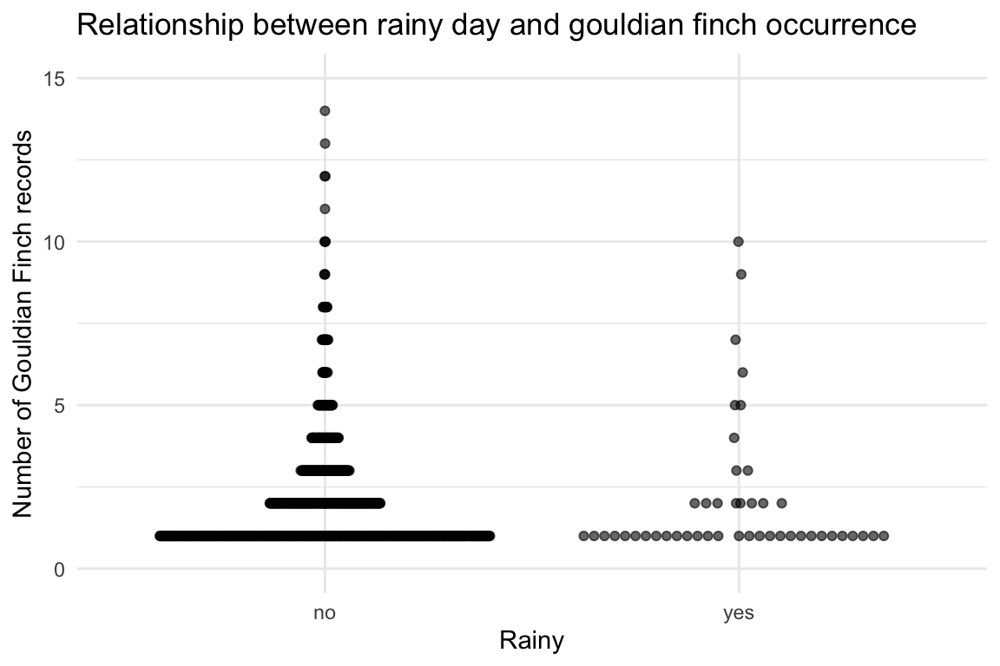
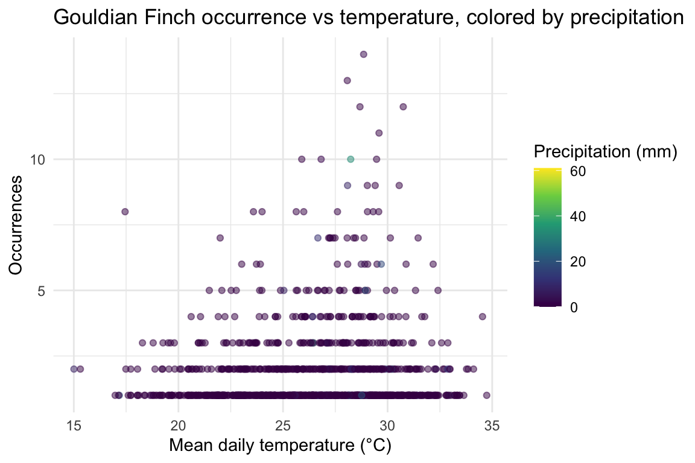

# Gouldian Finch



Photo by Kym Nicolson. Licensed under [CC BY
4.0](https://creativecommons.org/licenses/by/4.0/).

## 1 Introduction

This vignette demonstrates how to **analyze occurrence data for Gouldian
Finch in Australia**, using records from the [Atlas of Living Australia
(ALA)](https://www.ala.org.au/).

The dataset has been prepared for you to explore, making it suitable for
both study and practice with real-world ecological data. In this
vignette we provide short examples of how to manipulate and visualize
the dataset, but you are encouraged to develop your own creative
approaches for analysis and visualization.

This is the glimpse of your data :

``` r

library(dplyr)
library(ecotourism)
data("gouldian_finch")
data("oz_sa2", package = "ecotourism")
data("weather", package = "ecotourism")
gouldian_finch |> glimpse()
```

    Rows: 3,922
    Columns: 14
    $ obs_lat     <dbl> -38.28428, -35.54665, -35.41374, -33.76889, -33.76889, -33…
    $ obs_lon     <dbl> 141.6337, 138.8717, 149.0669, 151.1119, 151.1119, 151.1119…
    $ date        <date> 2015-01-25, 2021-01-03, 2016-12-13, 2014-04-24, 2014-04-2…
    $ time        <chr> "15:15:00", "15:01:16", "10:30:00", "00:00:00", "00:00:00"…
    $ year        <dbl> 2015, 2021, 2016, 2014, 2014, 2014, 2017, 2017, 2017, 2014…
    $ month       <dbl> 1, 1, 12, 4, 4, 4, 1, 2, 2, 12, 5, 4, 4, 4, 4, 5, 4, 6, 6,…
    $ day         <dbl> 25, 3, 13, 24, 24, 24, NA, 17, 9, 10, 28, 27, 26, 17, 23, …
    $ hour        <int> 15, 15, 10, 0, 0, 0, 0, 15, 14, 13, 15, 6, 6, 6, 6, 6, 8, …
    $ weekday     <ord> Sunday, Sunday, Tuesday, Thursday, Thursday, Thursday, Sun…
    $ dayofyear   <dbl> 25, 3, 348, 114, 114, 114, 1, 48, 40, 344, 148, 118, 117, …
    $ sci_name    <chr> "Chloebia gouldiae", "Chloebia gouldiae", "Chloebia gouldi…
    $ record_type <chr> "HUMAN_OBSERVATION", "HUMAN_OBSERVATION", "HUMAN_OBSERVATI…
    $ obs_state   <chr> "Victoria", "South Australia", "Australian Capital Territo…
    $ ws_id       <chr> "948280-99999", "946770-99999", "949250-99999", "957650-99…

------------------------------------------------------------------------

## 2 Visualization

### 2.1 Spatial Distribution Map

Distribution of Occurrence Gouldian Finch Sightings in Australia

``` r

library(ggplot2)
library(ggthemes)

gouldian_finch |> 
  ggplot() +
    geom_sf(data = oz_sa2) +
    geom_point(aes(x = obs_lon, y = obs_lat), color = "red") +
    theme_map()
```



Keep in mind that the natural range of the **Gouldian Finch** is in
northern Australia. Occasional records from the south may reflect birds
in captivity, such as those observed in zoos, rather than wild
populations.

------------------------------------------------------------------------

## 3 Weekly, Monthly, and Yearly Trends

Weekday Distribution of Gouldian Finch Sightings

``` r

week_order <- c("Monday", "Tuesday", "Wednesday", "Thursday", "Friday", "Saturday", "Sunday")

gouldian_finch |> 
  ggplot(aes(x = factor(weekday, levels = week_order))) +
    geom_bar() +
    labs(x = "Weekday", y = "Number of Records") +
    theme_minimal()
```



Monthly Distribution of Gouldian Finch Sightings

``` r

library(lubridate)

gouldian_finch |>
    dplyr::mutate(month = month(month, label = TRUE, abbr = TRUE)) |>
    ggplot(aes(x = factor(month))) +
    geom_bar() +
    labs(x = "Month", y = "Number of Records") +
    theme_minimal()
```



Yearly Distribution of Gouldian Finch Sightings

``` r

gouldian_finch |>
    ggplot(aes(x = factor(year))) +
    geom_bar() +
    labs(x = "Year", y = "Number of Records")+
    theme_minimal()
```



------------------------------------------------------------------------

## 4 Relational visualization

We want to see if `gouldian_finch` occurrences are related to
precipitation on the same day from the weather dataset.

Here’s a short R script that:

1.  Joins `gouldian_finch` with **weather** using `ws_id` and `date`.

2.  Counts daily occurrences.

3.  Plots precipitation vs number of `gouldian_finch` sightings.

``` r

library(ggbeeswarm)

# Prepare gouldian_finch occurrence counts per day
gouldian_finch_daily <- gouldian_finch |>
  group_by(ws_id, date) |>
  summarise(occurrence = n(), .groups = "drop")

# Join with weather data for precipitation
gouldian_finch_weather <- gouldian_finch_daily |>
  left_join(weather |> select(ws_id, date, prcp), 
            by = c("ws_id", "date"))

gouldian_finch_weather |>
  filter(!is.na(prcp)) |>
  mutate(rain = if_else(prcp > 5, "yes", "no")) |>
  ggplot(aes(x = rain, y = occurrence)) +
  geom_quasirandom(alpha = 0.6) +
  ylim(c(0, 15)) +
  labs(
    title = "Relationship between rainy day and gouldian finch occurrence",
    x = "Rainy",
    y = "Number of Gouldian Finch records"
  ) +
  theme_minimal()
```



``` r

gouldian_finch_weather <- gouldian_finch_daily |> 
  left_join(
    weather |> select(ws_id, date, temp, prcp),
    by = c("ws_id", "date")
  )


ggplot(gouldian_finch_weather, aes(temp, occurrence, color = prcp)) +
  geom_point(alpha = 0.5) +
  scale_color_viridis_c() +
  labs(
    title = "Gouldian Finch occurrence vs temperature, colored by precipitation",
    x = "Mean daily temperature (°C)",
    y = "Occurrences",
    color = "Precipitation (mm)"
  ) +
  theme_minimal()
```


