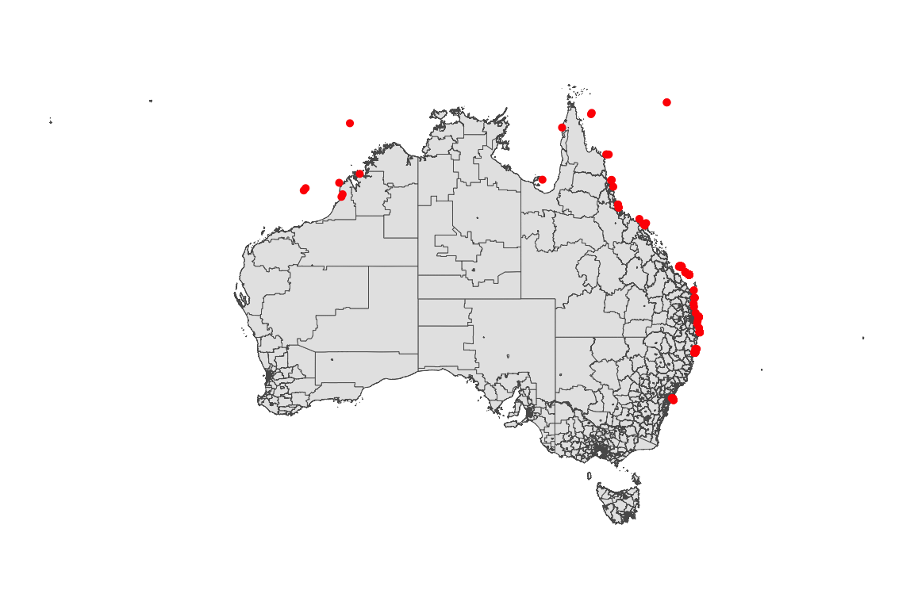
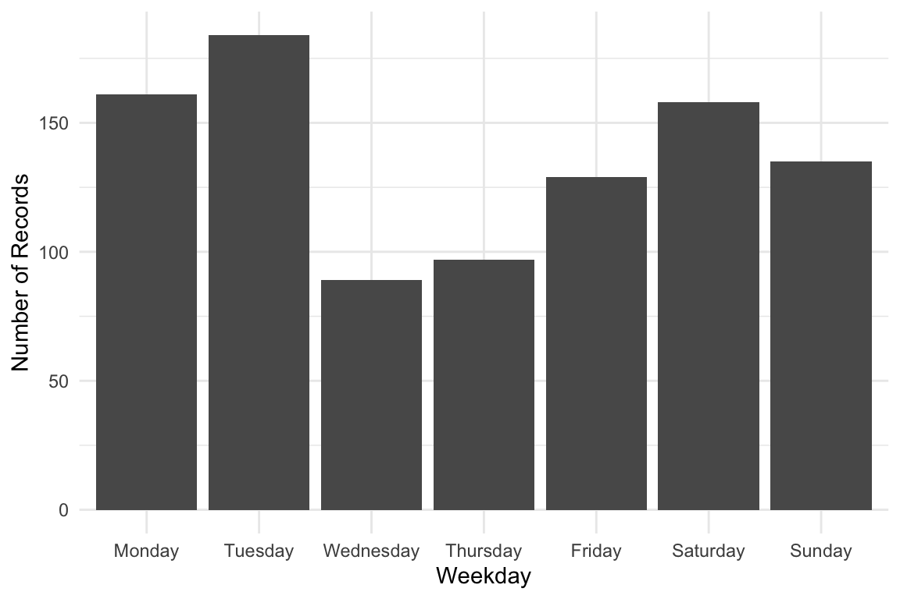
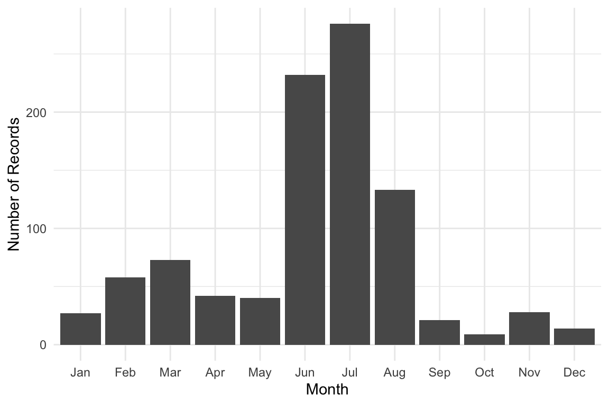
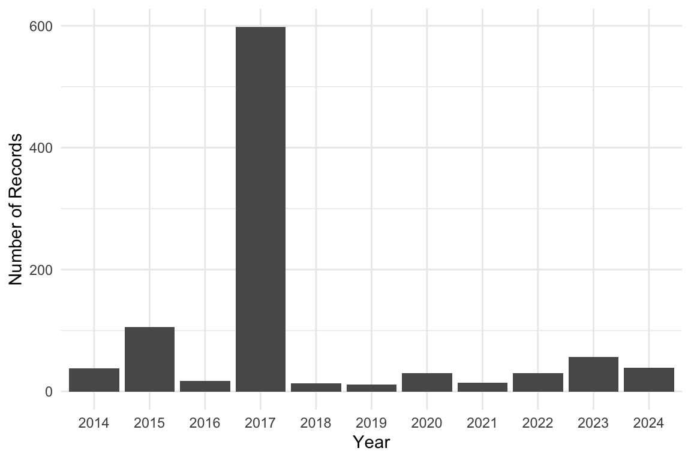
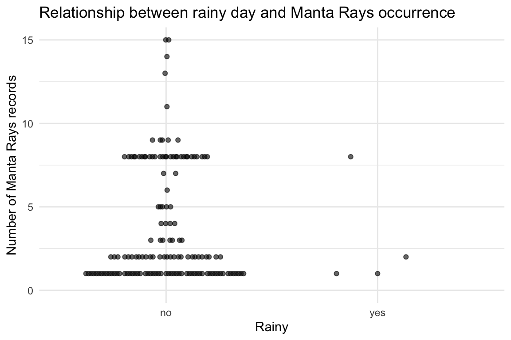
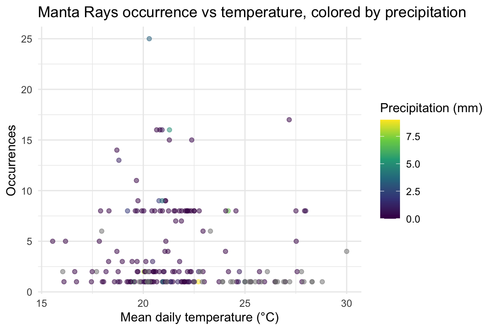

# Manta Rays


Photograph by Di Cook.

## 1 Introduction

This vignette demonstrates how to **analyze occurrence data for Manta
Rays in Australia**, using records from the [Atlas of Living Australia
(ALA)](https://www.ala.org.au/).

The dataset has been prepared for you to explore, making it suitable for
both study and practice with real-world ecological data. In this
vignette we provide short examples of how to manipulate and visualize
the dataset, but you are encouraged to develop your own creative
approaches for analysis and visualization.

------------------------------------------------------------------------

This is the glimpse of your data :

``` r

library(dplyr)
library(ecotourism)
data("manta_rays")
data("oz_sa2", package = "ecotourism")
data("weather", package = "ecotourism")
manta_rays |> glimpse()
```

    Rows: 953
    Columns: 14
    $ obs_lat     <dbl> -33.93000, -33.93000, -33.93000, -33.80058, -33.80012, -33…
    $ obs_lon     <dbl> 151.3500, 151.3500, 151.3500, 151.2955, 151.2969, 151.2948…
    $ date        <date> 2014-01-04, 2015-07-28, 2014-08-07, 2024-12-22, 2024-12-2…
    $ time        <chr> "00:00:00", "00:00:00", "00:00:00", "11:44:00", "12:50:25"…
    $ year        <dbl> 2014, 2015, 2014, 2024, 2024, 2024, 2014, 2017, 2017, 2017…
    $ month       <dbl> 1, 7, 8, 12, 12, 12, 4, 3, 3, 2, 2, 3, 2, 3, 11, 2, 2, 3, …
    $ day         <dbl> 4, 28, 7, 22, 22, 22, 25, 3, 4, 27, 26, 3, 26, 2, 29, 26, …
    $ hour        <int> 0, 0, 0, 11, 12, 8, 6, 0, 0, 0, 0, 0, 0, 0, 0, 0, 0, 0, 0,…
    $ weekday     <ord> Saturday, Tuesday, Thursday, Sunday, Sunday, Sunday, Frida…
    $ dayofyear   <dbl> 4, 209, 219, 357, 357, 357, 115, 62, 63, 58, 57, 62, 57, 6…
    $ sci_name    <chr> "Mobula alfredi", "Mobula alfredi", "Mobula alfredi", "Mob…
    $ record_type <chr> "MACHINE_OBSERVATION", "MACHINE_OBSERVATION", "MACHINE_OBS…
    $ obs_state   <chr> NA, NA, NA, "New South Wales", "New South Wales", "New Sou…
    $ ws_id       <chr> "947800-99999", "947800-99999", "947800-99999", "957680-99…

------------------------------------------------------------------------

## 2 Visualization

### 2.1 Spatial Distribution Map

Distribution of Occurrence Manta Rays Sightings in Australia

``` r

library(ggplot2)
library(ggthemes)

manta_rays |> 
  ggplot() +
    geom_sf(data = oz_sa2) +
    geom_point(aes(x = obs_lon, y = obs_lat), color = "red") +
    theme_map()
```



## 3 Weekly, Monthly, and Yearly Trends

Weekday Distribution of Manta Rays Sightings

``` r

week_order <- c("Monday", "Tuesday", "Wednesday", "Thursday", "Friday", "Saturday", "Sunday")

manta_rays |> 
  ggplot(aes(x = factor(weekday, levels = week_order))) +
    geom_bar() +
    labs(x = "Weekday", y = "Number of Records") +
    theme_minimal()
```



Monthly Distribution of Manta Rays Sightings

``` r

library(lubridate)
manta_rays |>
    dplyr::mutate(month =month(month, label = TRUE, abbr = TRUE)) |>
    ggplot(aes(x = factor(month))) +
    geom_bar() +
    labs(x = "Month", y = "Number of Records") +
    theme_minimal()
```



Yearly Distribution of Manta Rays Sightings

``` r

manta_rays |>
    ggplot(aes(x = factor(year))) +
    geom_bar() +
    labs(x = "Year", y = "Number of Records") +
    theme_minimal()
```



------------------------------------------------------------------------

## 4 Relational visualization

We want to see if `manta_rays` occurrences are related to precipitation
on the same day from the weather dataset.

Here’s a short R script that:

1.  Joins `manta_rays` with **weather** using `ws_id` and `date`.

2.  Counts daily occurrences.

3.  Plots precipitation vs number of `manta_rays` sightings.

``` r

library(ggbeeswarm)

# Prepare manta_rays occurrence counts per day
manta_rays_daily <- manta_rays |>
  group_by(ws_id, date) |>
  summarise(occurrence = n(), .groups = "drop")

# Join with weather data for precipitation
manta_rays_weather <- manta_rays_daily |>
  left_join(weather |> select(ws_id, date, prcp), 
            by = c("ws_id", "date"))

# Simple plot: rainy day vs manta_rays occurrence
manta_rays_weather |>
  filter(!is.na(prcp)) |>
  mutate(rain = if_else(prcp > 5, "yes", "no")) |>
  ggplot(aes(x = rain, y = occurrence)) +
  geom_quasirandom(alpha = 0.6) +
  ylim(c(0, 15)) +
  labs(
    title = "Relationship between rainy day and Manta Rays occurrence",
    x = "Rainy",
    y = "Number of Manta Rays records"
  ) +
  theme_minimal()
```



``` r

manta_rays_weather <- manta_rays_daily |> 
  left_join(
    weather |> select(ws_id, date, temp, prcp),
    by = c("ws_id", "date")
  )


ggplot(manta_rays_weather, aes(temp, occurrence, color = prcp)) +
  geom_point(alpha = 0.5) +
  scale_color_viridis_c() +
  labs(
    title = "Manta Rays occurrence vs temperature, colored by precipitation",
    x = "Mean daily temperature (°C)",
    y = "Occurrences",
    color = "Precipitation (mm)"
  ) +
  theme_minimal()
```


