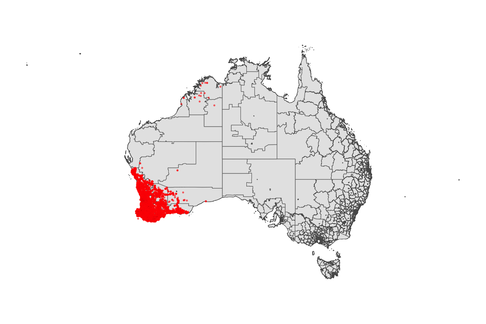
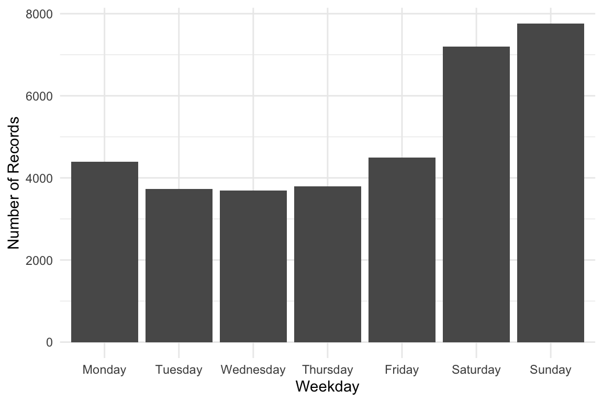
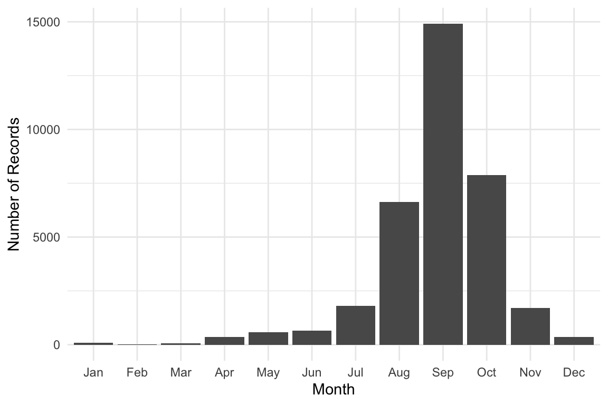
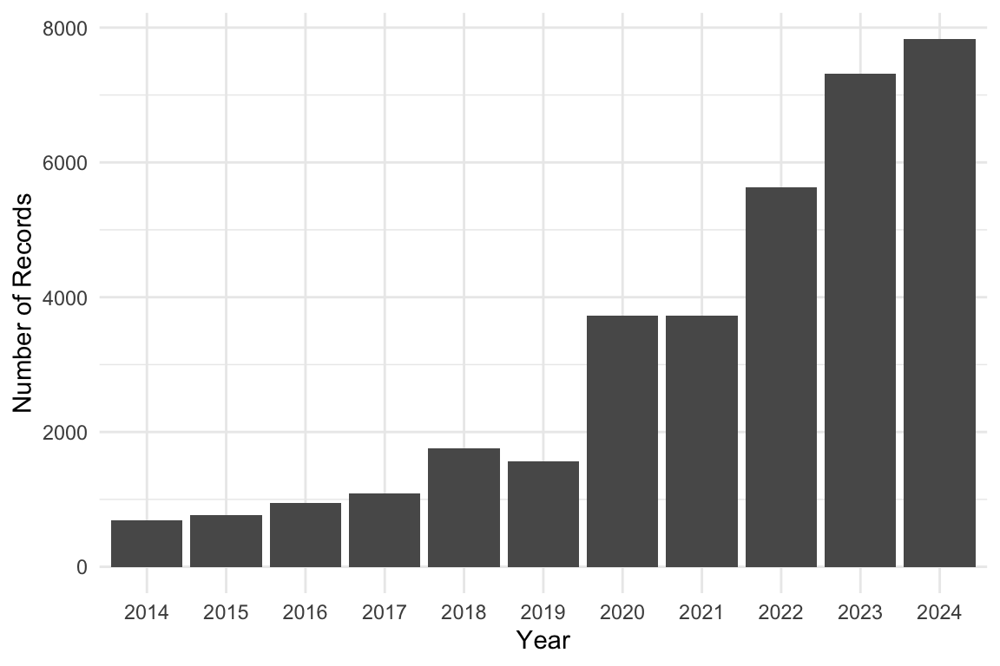
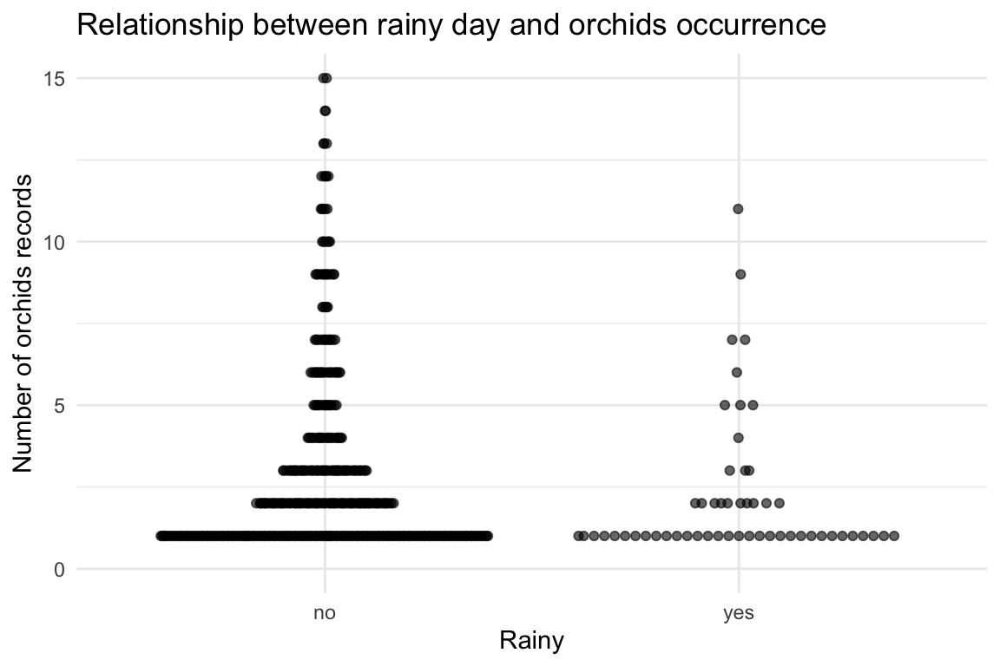
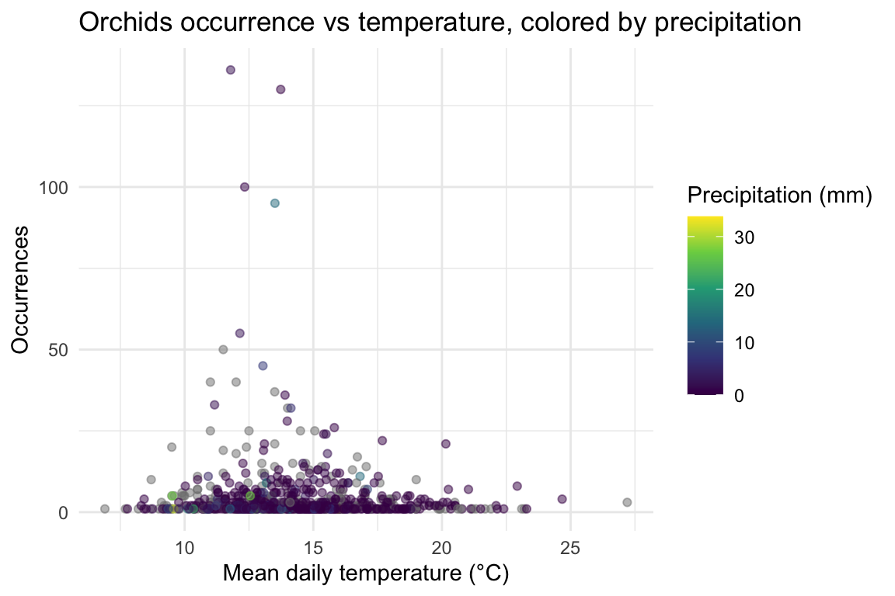

# Orchids


Orchids, Photo taken by Lyn Cook.

## 1 Introduction

This vignette demonstrates how to **analyze occurrence data for Orchids
in Australia**, using records from the [Atlas of Living Australia
(ALA)](https://www.ala.org.au/).

The dataset has been prepared for you to explore, making it suitable for
both study and practice with real-world ecological data. In this
vignette we provide short examples of how to manipulate and visualize
the dataset, but you are encouraged to develop your own creative
approaches for analysis and visualization.

------------------------------------------------------------------------

This is the glimpse of your data :

``` r

library(dplyr)
library(ecotourism)
data("orchids")
data("oz_sa2", package = "ecotourism")
data("weather", package = "ecotourism")
orchids |> glimpse()
```

    Rows: 35,052
    Columns: 14
    $ obs_lat     <dbl> -35.20000, -35.20000, -35.20000, -35.20000, -35.20000, -35…
    $ obs_lon     <dbl> 117.8000, 118.0000, 116.7000, 117.7000, 117.6000, 117.8073…
    $ date        <date> 2017-09-11, 2019-08-02, 2016-10-06, 2017-09-07, 2022-08-0…
    $ time        <chr> "18:08:00", "12:38:00", "17:32:00", "09:30:00", "09:21:09"…
    $ year        <dbl> 2017, 2019, 2016, 2017, 2022, 2024, 2024, 2021, 2024, 2016…
    $ month       <dbl> 9, 8, 10, 9, 8, 9, 8, 9, 10, 10, 9, 10, 9, 4, 10, 10, 7, 9…
    $ day         <dbl> 11, 2, 6, 7, 6, 18, 23, 23, 19, 3, 30, 23, 25, 10, 9, 4, 3…
    $ hour        <int> 18, 12, 17, 9, 9, 10, 9, 16, 11, 14, 13, 12, 12, 16, 16, 1…
    $ weekday     <ord> Monday, Friday, Thursday, Thursday, Saturday, Wednesday, F…
    $ dayofyear   <dbl> 254, 214, 280, 250, 218, 262, 236, 266, 293, 277, 273, 297…
    $ sci_name    <chr> "Pterostylis heberlei", "Corybas limpidus", "Caladenia int…
    $ record_type <chr> "HUMAN_OBSERVATION", "HUMAN_OBSERVATION", "HUMAN_OBSERVATI…
    $ obs_state   <chr> "Western Australia", "Western Australia", "Western Austral…
    $ ws_id       <chr> "948010-99999", "948010-99999", "956470-99999", "948010-99…

------------------------------------------------------------------------

## 2 Visualization

### 2.1 Spatial Distribution Map

Distribution of Occurrence Orchids Sightings in Australia

``` r

library(ggplot2)
library(ggthemes)

orchids |> 
  ggplot() +
    geom_sf(data = oz_sa2) +
    geom_point(
      aes(x = obs_lon, y = obs_lat), color = "red", alpha = 0.5, size = 0.3) +
    theme_map()
```



------------------------------------------------------------------------

## 3 Weekly, Monthly, and Yearly Trends

Weekday Distribution of Orchids Sightings

``` r

week_order <- c("Monday", "Tuesday", "Wednesday", "Thursday", "Friday", "Saturday", "Sunday")

orchids |> 
  ggplot(aes(x = factor(weekday, levels = week_order))) +
    geom_bar() +
    labs(x = "Weekday", y = "Number of Records") +
    theme_minimal()
```



Monthly Distribution of Orchids Sightings

``` r

library(lubridate)

orchids |>
    dplyr::mutate(month = month(month, label = TRUE, abbr = TRUE)) |>
    ggplot(aes(x = factor(month))) +
    geom_bar() +
    labs(x = "Month", y = "Number of Records") +
    theme_minimal()
```



Yearly Distribution of Orchids Sightings

``` r

orchids |>
    ggplot(aes(x = factor(year))) +
    geom_bar() +
    labs(x = "Year", y = "Number of Records") +
    theme_minimal()
```



------------------------------------------------------------------------

## 4 Relational visualization

We want to see if `orchids` occurrences are related to precipitation on
the same day from the weather dataset.

Here’s a short R script that:

1.  Joins `orchids` with **weather** using `ws_id` and `date`.

2.  Counts daily occurrences.

3.  Plots precipitation vs number of `orchids` sightings.

``` r

library(ggbeeswarm)

# Prepare orchids occurrence counts per day
orchids_daily <- orchids |>
  group_by(ws_id, date) |>
  summarise(occurrence = n(), .groups = "drop")

# Join with weather data for precipitation
orchids_weather <- orchids_daily |>
  left_join(weather |> select(ws_id, date, prcp), 
            by = c("ws_id", "date"))

orchids_weather |>
  filter(!is.na(prcp)) |>
  mutate(rain = if_else(prcp > 5, "yes", "no")) |>
  ggplot(aes(x = rain, y = occurrence)) +
  geom_quasirandom(alpha = 0.6) +
  ylim(c(0, 15)) +
  labs(
    title = "Relationship between rainy day and orchids occurrence",
    x = "Rainy",
    y = "Number of orchids records"
  ) +
  theme_minimal()
```



``` r

orchids_weather <- orchids_daily |> 
  left_join(
    weather |> select(ws_id, date, temp, prcp),
    by = c("ws_id", "date")
  )


ggplot(orchids_weather, aes(temp, occurrence, color = prcp)) +
  geom_point(alpha = 0.5) +
  scale_color_viridis_c() +
  labs(
    title = "Orchids occurrence vs temperature, colored by precipitation",
    x = "Mean daily temperature (°C)",
    y = "Occurrences",
    color = "Precipitation (mm)"
  ) +
  theme_minimal()
```


