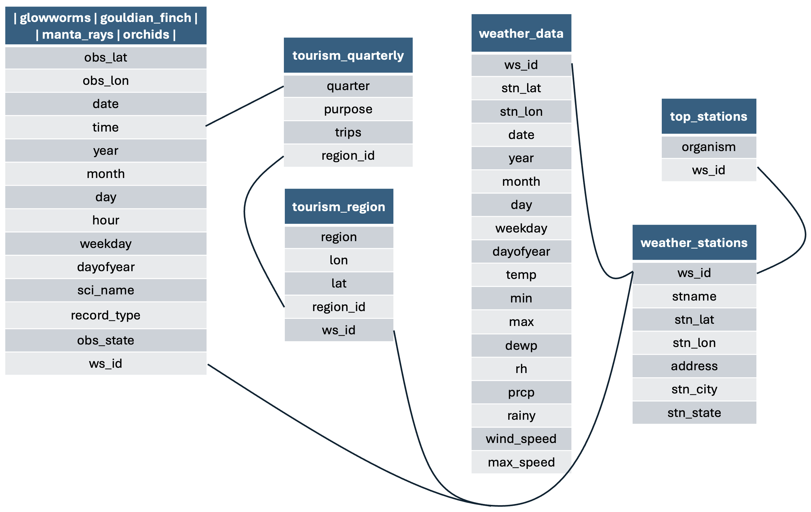

# ecotourism

The goal of **ecotourism** is to provide clean, ready-to-use datasets
for example analyses in teaching, demos, and reproducible workflows.  
It currently includes wildlife (e.g., cuttlefish) occurrence records,
tourism counts by region, and local weather for matching locations.

## Website

👉 Documentation site: **<https://vahdatjavad.github.io/ecotourism/>**

## Installation

Install the development version from GitHub:

``` r

# install.packages("pak")
pak::pak("vahdatjavad/ecotourism")
```

If you prefer `remotes`:

``` r

# install.packages("remotes")
remotes::install_github("vahdatjavad/ecotourism")
```

## What’s inside?

List all available datasets and their short titles:

| Object           | Title                                           |
|:-----------------|:------------------------------------------------|
| glowworms        | Glowworms Occurrence Data (2014–2024)           |
| gouldian_finch   | Gouldian Finch Occurrence Data (2014–2024)      |
| manta_rays       | Manta Ray Occurrence Data (2014–2024)           |
| orchids          | Orchid Occurrence Data (2014–2024)              |
| top_stations     | Top Weather Stations for Each Organism          |
| weather_data     | Daily Weather Data for Top Stations (2014–2024) |
| weather_stations | Australian Weather Station Metadata             |
| tourism_region   | Australian tourism regions with lat and lon.    |

This is the relational dataset in this package:



To see documentation for any dataset, use:

``` r

?ecotourism::DATASET_NAME
```

## Example

This is a minimal usage sketch. Replace `DATASET_NAME` with one from the
table above.

``` r

library(ecotourism)

# List datasets included in the package
utils::data(package = "ecotourism")

# Example workflow (replace DATASET_NAME with a real object from the list)
# data("DATASET_NAME", package = "ecotourism")
# head(DATASET_NAME)
# str(DATASET_NAME)

# Tip: quick summaries if dplyr is available:
# if (requireNamespace("dplyr", quietly = TRUE)) {
#   dplyr::glimpse(DATASET_NAME)
# }
```

## Getting help

- Open an issue with a minimal reproducible example:
  <https://github.com/vahdatjavad/ecotourism/issues>
- Check the function/dataset help pages (e.g.,
  `?ecotourism::DATASET_NAME`).

## Contributing

Pull requests are welcome! If you’re unsure where to start, open an
issue first to discuss changes.

## Citation

If you use **ecotourism** in teaching, demos, or research, please cite
it:

``` r

citation("ecotourism")
```
