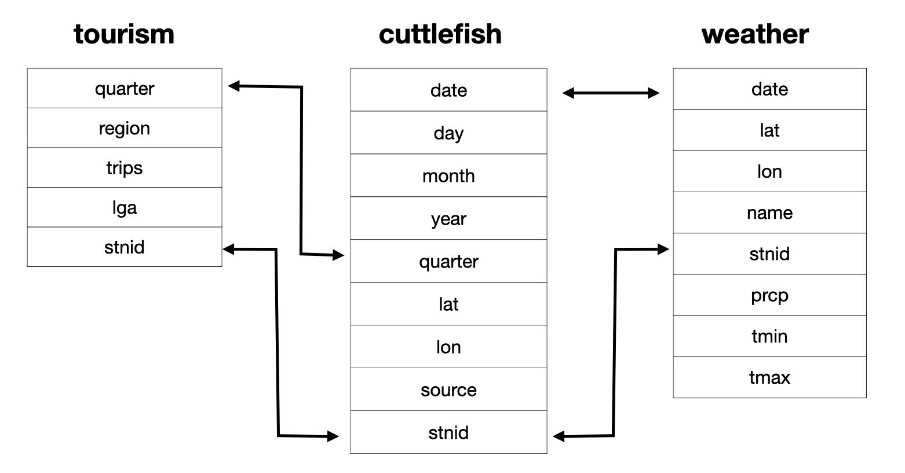

# About the data

There are several data sets in the package:

- `cuttlefish`: occurrences of giant cuttlefish; links to weather and tourism by `stnid`
- `tourism`: quarterly counts of different types of tourism, holiday, visiting family, business, other; links to weather by `stnid`
- `weather`: daily min and max temperature records
- `oz_lga`: spatial polygon map of Australian local government areas (LGAs) 
- `stations`: weather station id's and spatial coordinates matching the occurrence data, `stnid` is key for linking data sets.



# Wild thing: cuttlefish


```{r cuttlefish}
#| echo: false
#| message: false
#| warning: false
library(ecotourism)
library(dplyr)
library(ggplot2)
library(ggthemes)
library(lubridate)
data(oz_lga)
data(cuttlefish)
ggplot(oz_lga) +
  geom_sf(colour="white", fill="grey90") +
  geom_point(data=cuttlefish, aes(x=lon, y=lat,
                                  label=date),
             colour="#EA6900", alpha=0.5) +
  xlim(c(113.09, 153.38)) +
  ylim(c(-43.38, -10.41)) +
  theme_map()
```

<!-- - Plot occurrences on map for spatial distribution
- Aggregate occurrences on week or month or year to examine temporal patterns
- Remember: this is sighting data, only available when people report -->

# Weather

The weather data is used to understand if the sightings tend to happen when it is dry, or not to hot or cold.

```{r weather}
#| echo: false
#| message: false
#| warning: false
#| fig-width: 8
#| fig-height: 2.5
#| out-width: 100%
data(weather)
weather |>
  mutate(month = month(date, label=TRUE, abbr=TRUE)) |>
  ggplot(aes(x=month, y=prcp)) + 
    geom_boxplot() + 
    scale_y_log10() +
    xlab("")
```

# Tourism

The tourism records are to examine whether tourists might be visiting at peak sighting times.

```{r tourism}
#| echo: false
#| message: false
#| warning: false
#| fig-width: 8
#| fig-height: 2.5
#| out-width: 100%
data(tourism)
tourism |>
  filter(Region == "Whyalla", Purpose == "Holiday") |>
  mutate(Quarter = myd(Quarter)) |>
  ggplot(aes(x=Quarter, y=Trips)) + 
    geom_point() + 
    geom_smooth(se = F) +
    xlab("")
```
