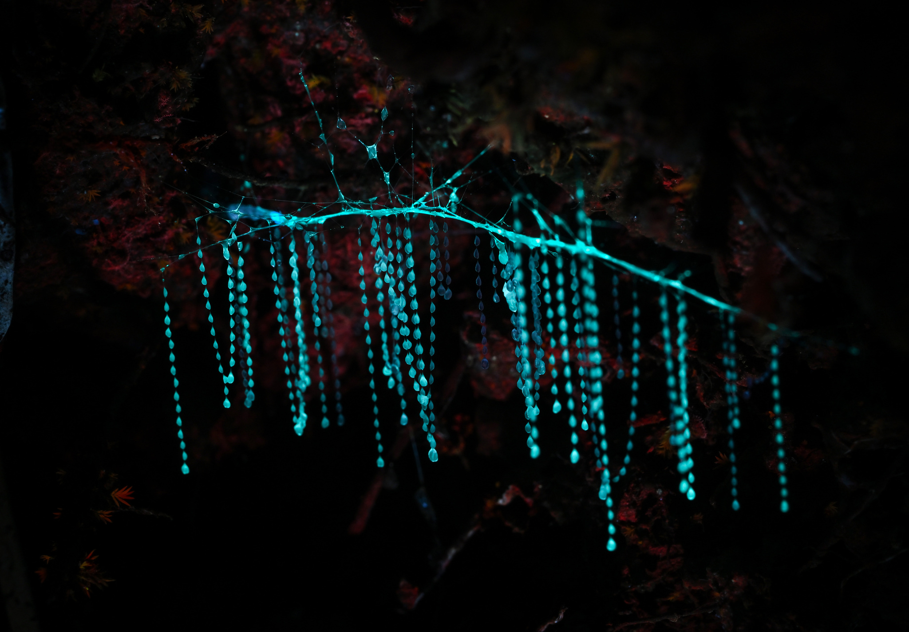

---
vignette: >
  %\VignetteIndexEntry{Glowworms}
  %\VignetteEngine{quarto::html}
  %\VignetteEncoding{UTF-8}
---

<center></center>

## Introduction

This vignette demonstrates how to reproduce and analyze occurrence data for **Glowworms** in Australia, using data from the [Atlas of Living Australia (ALA)](https://www.ala.org.au/). You'll learn how to download, clean, enrich, and visualize data with practical, reproducible R functions.

------------------------------------------------------------------------

## Load Required Packages and Utilities

All required functions are organized in `vignette-utils.R`. You can import them using:

```{r, echo=TRUE, message=FALSE, warning=FALSE, eval=FALSE}
source("vignette-utils.R")
```

If you'd like to modify the helper functions, you can find them here:\
`ecotourism/vignettes/vignette-utils.R`

------------------------------------------------------------------------

## Define Global Parameters

We define basic variables used throughout the vignette:

```{r echo=TRUE, eval=TRUE}
# global variables
email <- "your_email@email.com"
organism_name <- "glowworms"
organism_title <- "Glowworms"
taxa     <- "Arachnocampa"
start    <- 2014
end      <- 2024
```

------------------------------------------------------------------------

## Step 1: Download and Prepare Occurrence Data

```{r eval=FALSE, echo=TRUE, message=FALSE, warning=FALSE}
organism <- obs_data(taxa, start, end, your_email=email) |> polished_data()
```

> This downloads ALA data and performs standard cleaning: renaming columns and removing `NA`s.

------------------------------------------------------------------------

## Step 2: Save Cleaned Dataset

```{r eval=FALSE, echo=TRUE, message=FALSE, warning=FALSE}
mysave(organism_name, organism)
```

This saves the object to the `/data` folder with the name `"glowworms.rda"`.

------------------------------------------------------------------------

## Step 3: Attach Nearest Weather Station

```{r, echo=TRUE, message=FALSE, eval=FALSE}
attach_nearest_station(organism_name)
```

> Weather data is restricted to the top 3 stations to keep it lightweight.

------------------------------------------------------------------------

## Step 4: Load and Explore the Data

```{r, echo=TRUE, eval=FALSE}
load("../data/glowworms.rda")
glimpse(glowworms)
```

------------------------------------------------------------------------

## Step 5: Save Raw Version for Further Analysis

```{r "request data ALA", eval=FALSE, message=FALSE, warning=FALSE}
organism_raw <- obs_data(taxa, start, end, your_email=email) |> polished_data()

mysave_raw(organism_name, organism_raw)
```

To load it:

```{r , echo=TRUE, eval=FALSE}
organism_raw <- myload_raw(organism_name)
```

```{r , echo=TRUE, eval=FALSE}
organism_raw |> slice_head(n = 3) |> as_tibble() |> glimpse()
```

------------------------------------------------------------------------

## Step 6: Count Occurrences by State

```{r "number of occ in state", echo=TRUE, eval=FALSE}
organism_raw |> my_count(scientificName, obs_state) |> as_tibble() 
```

------------------------------------------------------------------------

## Step 7: Clean Taxonomic Ambiguity

```{r echo=TRUE, fig.width=6, fig.height=4, eval=FALSE}
radius_threshold <- 250000

unknowns <- organism_raw |> filter(scientificName == "Arachnocampa")
references <- organism_raw |> filter(scientificName == "Arachnocampa flava")

assign_if_close_to_flava <- function(lat, lon, flava_data, radius) {
  dists <- distHaversine(
    matrix(c(lon, lat), ncol = 2),
    matrix(c(flava_data$obs_lon, flava_data$obs_lat), ncol = 2)
  )
  if (any(dists <= radius)) "Arachnocampa flava" else "Arachnocampa"
}

unknowns_updated <- unknowns |> 
  rowwise() |> 
  mutate(scientificName = assign_if_close_to_flava(obs_lat, obs_lon, references, radius_threshold)) |> 
  ungroup()

organism <- organism_raw |> 
  filter(scientificName != "Arachnocampa") |> 
  bind_rows(unknowns_updated) |> 
  filter(!is.na(obs_lat), !is.na(obs_lon), !is.na(month),
         scientificName %in% c("Arachnocampa flava", "Arachnocampa tasmaniensis"))

mysave(organism_name, organism)
```

------------------------------------------------------------------------

## Visualization

### Spatial Distribution Map

```{r echo=TRUE, fig.width=6, fig.height=4, eval=FALSE}
organism |> plot_map1(color_by = scientificName)
```

### Occurrence by State (Updated)

```{r echo=TRUE, fig.width=6, fig.height=4, eval=FALSE}
organism |> my_count(scientificName, obs_state) |> as_tibble()
```

------------------------------------------------------------------------

## Weekly, Monthly, and Yearly Trends

```{r echo=TRUE, fig.width=6, fig.height=4, eval=FALSE}
organism |> plot_bar_week()
organism |> plot_bar_week_100()
organism |> plot_bar_month()
organism |> plot_bar_year()
```

------------------------------------------------------------------------

## Weather Station Analysis

```{r echo=TRUE, fig.width=6, fig.height=4, eval=FALSE}
attach_nearest_station(organism_name)
organism <- myload(organism_name)
glimpse(head(organism, 2))
summarize_state_frequencies(organism_name)
```

------------------------------------------------------------------------

## Monthly and Seasonal Pattern Analysis

```{r echo=TRUE, fig.width=6, fig.height=4, eval=FALSE}
plot_monthly_occurrences_by_state(organism_name)
plot_weekly_occurrences_by_state(organism_name)
plot_seasonal_occurrence_polar(organism_name)
plot_monthly_occurrence_map(organism_name)
plot_monthly_occurrence_map_by_state(organism_name)
plot_monthly_distribution_map(organism_name)
```

------------------------------------------------------------------------

## Conclusion

You’ve now learned to:

-   Retrieve and clean ALA glowworm data
-   Match data with nearby weather stations
-   Refine taxonomic data and visualize patterns over time and space

------------------------------------------------------------------------

## Appendix

All helper functions used here are defined in:\
`vignettes/vignette-utils.R`

## Final Output

This is the glimps of your final data :
```{r, echo=TRUE, eval=FALSE, message=FALSE, warning=FALSE}
library(tidyverse)
load("../data/glowworms.rda")
glowworms |> glimpse()
```

```{r, echo=FALSE, eval=TRUE, message=FALSE, warning=FALSE}
library(tidyverse)
library(ecotourism)
data("glowworms")
glowworms |> glimpse()
```
