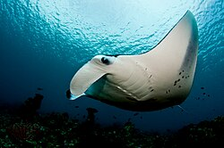

---
vignette: >
  %\VignetteIndexEntry{Manta Rays}
  %\VignetteEngine{quarto::html}
  %\VignetteEncoding{UTF-8}
---

```{r, echo=FALSE, message=FALSE, warning=FALSE}
# Ensure the temporary library from R CMD check is visible (esp. on Windows)
libdir <- Sys.getenv("R_LIBS")
if (nzchar(libdir)) {
  parts <- strsplit(libdir, .Platform$path.sep, fixed = TRUE)[[1]]
  .libPaths(unique(c(parts, .libPaths())))
}

# now load your package
suppressPackageStartupMessages(library(ecotourism))
```

<center></center>

## Introduction

This vignette walks you through the process of downloading, cleaning, and analyzing occurrence data for **Manta Rays** in Australia. The data is sourced from the [Atlas of Living Australia (ALA)](https://en.wikipedia.org/wiki/Manta_ray), enriched with weather metadata, and visualized using custom functions.

------------------------------------------------------------------------

## Load Required Packages and Utilities

All helper functions are stored in `vignette-utils.R`:

```{r, echo=TRUE, message=FALSE, warning=FALSE, eval=FALSE}
source("vignette-utils.R")
```

You can edit this file at:\
`ecotourism/vignettes/vignette-utils.R`

------------------------------------------------------------------------

## Define Global Parameters

```{r, echo=TRUE, message=FALSE, warning=FALSE, eval=FALSE}
organism_name <- "manta_rays"
organism_title <- "Manta Rays"
taxa <- "Mobula alfredi"
start <- 2014
end <- 2024
email <- "your_email@gmail.com"
```

------------------------------------------------------------------------

## Step 1: Download and Prepare Data

```{r, echo=TRUE, message=FALSE, warning=FALSE, eval=FALSE}
organism <- obs_data(taxa, start, end, your_email=email) |> 
  polished_data() |> 
  filter(scientificName == "Mobula alfredi")
```

------------------------------------------------------------------------

## Step 2: Save Cleaned Dataset

```{r, echo=TRUE, message=FALSE, warning=FALSE, eval=FALSE}
mysave(organism_name, organism)
```

------------------------------------------------------------------------

## Step 3: Attach Nearest Weather Station

```{r, echo=TRUE, message=FALSE, warning=FALSE, eval=FALSE}
attach_nearest_station(organism_name)
```

------------------------------------------------------------------------

## Step 4: Load and Preview Final Dataset

```{r, echo=TRUE, message=FALSE, warning=FALSE, eval=FALSE}
load("../data/manta_rays.rda")
glimpse(manta_rays)
```

------------------------------------------------------------------------

## Data Analysis

### Preview Dataset

```{r, echo=TRUE, message=FALSE, warning=FALSE, eval=FALSE}
organism <- myload(organism_name)
organism |> slice_head(n = 3) |> as_tibble() |> glimpse()
```

### Occurrence by State

```{r, echo=TRUE, message=FALSE, warning=FALSE, eval=FALSE}
organism |> my_count(scientificName, obs_state, f=1) |> as_tibble()
```

------------------------------------------------------------------------

## Visualization

### Spatial Distribution Map

```{r echo=TRUE, eval=FALSE, fig.width=6, fig.height=4}
organism |> plot_map1(color_by = scientificName)
```

### Weekly Trends

```{r echo=TRUE, eval=FALSE, fig.width=6, fig.height=4}
organism |> plot_bar_week()
```

### Monthly Trends

```{r echo=TRUE, eval=FALSE, fig.width=6, fig.height=4}
organism |> plot_bar_month()
```

### Yearly Trends

```{r echo=TRUE, eval=FALSE, fig.width=6, fig.height=4}
organism |> plot_bar_year()
```

------------------------------------------------------------------------

## Weather Station Mapping

```{r echo=TRUE, eval=FALSE, fig.width=6, fig.height=4}
attach_nearest_station(organism_name)
organism <- myload(organism_name)
organism |> glimpse()
```

------------------------------------------------------------------------

### State-wise Weather Matching Summary

```{r echo=TRUE, eval=FALSE, fig.width=6, fig.height=4}
summarize_state_frequencies(organism_name)
```

**Interpretation:**

-   **Queensland**:\
    884 observations; 888 matched with QLD weather stations.

-   **Western Australia**:\
    84 observations; 127 matched with WA stations — implying cross-state assignment.

------------------------------------------------------------------------

## Pattern Analysis

```{r echo=TRUE, eval=FALSE, fig.width=6, fig.height=4}
plot_monthly_occurrences_by_state(organism_name)
plot_weekly_occurrences_by_state(organism_name)
plot_seasonal_occurrence_polar(organism_name)
plot_monthly_occurrence_map(organism_name)
plot_monthly_occurrence_map_by_state(organism_name)
plot_monthly_distribution_map(organism_name)
```

------------------------------------------------------------------------

## Conclusion

You now know how to:

-   Retrieve and clean occurrence data for Manta Rays
-   Attach nearest weather station metadata
-   Explore distribution patterns in space and time

This reproducible workflow can be adapted for other marine species or ecotourism-relevant taxa in Australia.

## Final Output

This is the glimps of your final data :

```{r, echo=TRUE, eval=FALSE, message=FALSE, warning=FALSE}
library(dplyr)
load("../data/manta_rays.rda")
manta_rays |> glimpse()
```

```{r, echo=FALSE, eval=TRUE, message=FALSE, warning=FALSE}
library(dplyr)
library(ecotourism)
data("manta_rays")
manta_rays |> glimpse()
```
