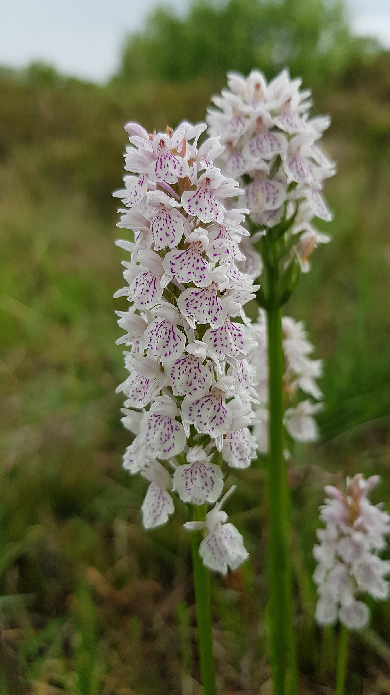

```{r, include = FALSE}
knitr::opts_chunk$set(
  collapse = TRUE,
  comment = "#"
)
```

<div style="text-align: center;">
  
</div>


# Data Reproducibility

In this document you gonna learn how to reproduce data of Orchids and make your changes to get final and polished data set.


first you need to load required packages and function all together in one file `vignette-utils.R` and import them with `source()` in R. In order to make change in functions you can access this utile file in this address: `ecotourism/vignettes/vignette-utils.R`

```{r, echo=TRUE, message=FALSE, warning=FALSE, eval=TRUE}
source("vignette-utils.R")
```

We are investigating occurrence data of [**orchids(Orchidaceae)**](https://en.wikipedia.org/wiki/Orchid) in Australia from the **Atlas of Living Australia**, and make a map showing the spatial locations of sightings from 2014 to 2024.


```{r echo=TRUE, eval=TRUE}
# global variables
organism_name <- "orchids"
organism_title <- "Orchids"
taxa     <- "Orchidaceae"
start    <- 2014
end      <- 2024

email = "vahdatjavad@gmail.com"
```

With the function of `obs_data` you can connect to occurrence data from ALA for a given taxon and time range and also you need to sign up with your email address in ALA website first. We are passing Retrieved data to `polished_data()` function in order to change some column name and also filter `NA` and missing data. Because it is a general function (that means you can change just taxa name and receive new dataset.) so that we use general name for assigning data but in the next section you can see that this dataset will be saved with `organism_name` in `/data` folder.

```{r eval=FALSE, echo=TRUE, message=FALSE, warning=FALSE}
organism <- obs_data(taxa, start, end, your_email=email) |> polished_data()
```

After receiving data from ALA we want to save it in R data format `rda` because it is compressed format and good to save our dataset in R data format. function of `mysave()` written by myself to automatically save `organism` dataset with `organism_name` in `/data` format. 

```{r eval=FALSE, echo=TRUE, message=FALSE, warning=FALSE}
mysave(organism_name, organism)
```

Now we want to add nearest `weather station` to each occurance of data. With `attach_nearest_station()` function we adding new column with name `weather_station_id` to data set and then save it again. 


```{r, echo=TRUE, message=FALSE, eval=FALSE}
attach_nearest_station(organism_name)
```

Because providing 10 years daily weather data for all stations are very hug and heavy data set, so we just chose top 3 station for each organism and then retrieved weather data just for those 3 station. 

So your final data looks like this:

```{r, echo=TRUE}
load("../data/orchids.rda")
glimpse(orchids)
```

# Data Analysis 

You learned how to find your data and request to download from galah api. here is more detail for ```r organism_title```. Below we are going to be more detailed in our organism.  


This is the head of data set:

```{r "print head of data", echo=FALSE}
organism <- myload(organism_name)
organism  |> glimpse()
```


Now we want to know the number of occurrence in each state:

```{r "number of occ in state", echo=FALSE}
organism |> my_count(scientificName, obs_state, f=1) |> as_tibble() 
```


## Visualization 
After changeing and assigning new species then we can save final version and plot it like below: 

```{r echo=FALSE, fig.width=6, fig.height=4}
# selected scientificName
# my selected species
mss <- c("Acianthus", "Acianthus fornicatus")

```

```{r echo=FALSE, fig.width=6, fig.height=4}
# Clean and prepare data
organism |> filter(scientificName %in% mss) |> plot_map1()

```

#### Weekly Distribution of organism

```{r echo=FALSE, fig.width=6, fig.height=4}
organism |>  filter(scientificName %in% mss) |> plot_bar_week()
```

#### Monthly Distribution of organism

```{r echo=FALSE, fig.width=6, fig.height=4}
organism |> filter(scientificName %in% mss) |> plot_bar_month()
```

#### Yearly Distribution of organism

```{r echo=FALSE, fig.width=6, fig.height=4}
organism |> filter(scientificName %in% mss) |> plot_bar_year()
```

## Nearest Weather Station Mapping

```{r, echo=FALSE, message=FALSE}
attach_nearest_station(organism_name)
```

```{r eval=TRUE, include=TRUE, echo=FALSE}
organism <- myload(organism_name)

organism |> glimpse()
```


```{r, echo=FALSE}

summarize_state_frequencies(organism_name)

```


## Pattern Analysis

```{r echo=FALSE, fig.width=8, fig.height=6}
plot_monthly_occurrences_by_state(organism_name, mss)
```

```{r echo=FALSE, fig.height=6, fig.width=8, message=FALSE, warning=FALSE}
plot_weekly_occurrences_by_state(organism_name, mss)
```

```{r, echo=FALSE, fig.width=8, fig.height=6}
plot_seasonal_occurrence_polar(organism_name, mss)
```

```{r echo=FALSE, fig.height=6, fig.width=8, message=FALSE, warning=FALSE}

plot_monthly_occurrence_map(organism_name, mss)


```


```{r echo=FALSE, fig.height=6, fig.width=8, message=FALSE, warning=FALSE}

plot_monthly_occurrence_map_by_state(organism_name, mss)

```

```{r echo=FALSE, fig.height=6, fig.width=8, message=FALSE, warning=FALSE}
plot_monthly_distribution_map(organism_name, mss)
```


