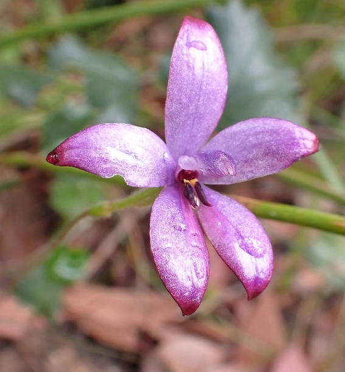

```{r, echo=FALSE, message=FALSE, warning=FALSE}
# Ensure the temporary library from R CMD check is visible (esp. on Windows)
libdir <- Sys.getenv("R_LIBS")
if (nzchar(libdir)) {
  parts <- strsplit(libdir, .Platform$path.sep, fixed = TRUE)[[1]]
  .libPaths(unique(c(parts, .libPaths())))
}

# now load your package
suppressPackageStartupMessages(library(ecotourism))
```

{fig-align="center" width="300"}

## Introduction

This vignette guides you through downloading, processing, and analyzing **Orchidaceae (Orchids)** occurrence data in Australia. Data is sourced from the [Atlas of Living Australia (ALA)](https://en.wikipedia.org/wiki/Orchid), enriched with weather station metadata, and visualized in multiple ways.

------------------------------------------------------------------------

This is the glimpse of your data :

```{r, echo=FALSE, eval=TRUE, message=FALSE, warning=FALSE}
library(dplyr)
library(ecotourism)
data("orchids")
orchids |> glimpse()
```

------------------------------------------------------------------------

## Visualization

### Spatial Distribution Map

Distribution of Occurrence Orchids Sightings in Australia

```{r echo=TRUE, fig.width=6, fig.height=4, eval=TRUE}
library(ggplot2)

orchids |> 
  ggplot() +
    geom_sf(data = oz_lga) +
    geom_point(aes(x = obs_lon, y = obs_lat), color = "red") +
    theme_minimal()
```

------------------------------------------------------------------------

## Weekly, Monthly, and Yearly Trends

Weekday Distribution of Orchids Sightings

```{r echo=TRUE, fig.width=6, fig.height=4, eval=TRUE}

week_order <- c("Monday", "Tuesday", "Wednesday", "Thursday", "Friday", "Saturday", "Sunday")

orchids |> 
  ggplot(aes(x = factor(weekday, levels = week_order))) +
    geom_bar() +
    labs(x = "Weekday", y = "Number of Records") +
    theme_minimal()
```

Monthly Distribution of Orchids Sightings

```{r echo=TRUE, fig.width=6, fig.height=4, eval=TRUE}
orchids |>
    dplyr::mutate(month = lubridate::month(month, label = TRUE, abbr = FALSE)) |>
    ggplot(aes(x = factor(month, levels = month.name))) +
    geom_bar() +
    labs(x = "Month", y = "Number of Records") +
    theme(axis.text.x = element_text(angle = 45, hjust = 1))
```

Yearly Distribution of Orchids Sightings

```{r echo=TRUE, fig.width=6, fig.height=4, eval=TRUE}
orchids |>
    ggplot(aes(x = factor(year))) +
    geom_bar() +
    labs(x = "Year", y = "Number of Records")
```
