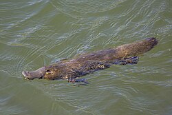

```{r, include = FALSE}
knitr::opts_chunk$set(
  collapse = TRUE,
  comment = "#>"
)
```

We are investigating occurrence data of the [**Platypus**](https://en.wikipedia.org/wiki/Platypus) in Australia from the **Atlas of Living Australia**, and make a map showing the spatial locations of sightings for 2024.

```{r echo=FALSE, message=FALSE, warning=FALSE}
# load required packages
library(galah)
library(dplyr)
library(ggplot2)
library(tidyverse)
```

```{r eval=FALSE, message=FALSE, warning=FALSE, include=FALSE}
# Set up ALA Access
galah_config(email = "vahdatjavad@gmail.com")

# Define and perform the search
platypus_taxon <- search_taxa("Ornithorhynchus")
occ_data <- galah_call() |> 
  galah_identify(platypus_taxon) |>  
  galah_filter(year == 2024) |>
  galah_select(decimalLatitude, decimalLongitude, year, eventDate, scientificName) |>
  atlas_occurrences()

# Drop records with missing coordinates
platypus_2024 <- occ_data |> 
  filter(!is.na(decimalLatitude), !is.na(decimalLongitude), !is.na(eventDate)) |> 
  rename(lat = decimalLatitude, lon = decimalLongitude)

# Save data
usethis::use_data(platypus_2024)
```

```{r echo=FALSE}
load("../data/platypus_2024.rda")
head(platypus_2024)
```

the length of the records is `r nrow(platypus_2024)`

#### Monthly Distribution of organism (2024)

```{r echo=FALSE, fig.width=6, fig.height=4}
platypus_2024$month <- format(platypus_2024$eventDate, "%B")
platypus_2024$month_num <- as.numeric(format(platypus_2024$eventDate, "%m"))

ggplot(platypus_2024, aes(x = factor(month, levels = month.name))) +
  geom_bar(fill = "steelblue") +
  labs(
    title = "Monthly Distribution of Platypus Occurrences (2024)",
    x = "Month", y = "Number of Records"
  ) +
  theme_bw() +
  theme(axis.text.x = element_text(angle = 45, hjust = 1))
```

#### Data Regularity & Temporal Gaps

```{r, echo=FALSE, fig.width=6, fig.height=4}
library(lubridate)
library(tidyr)

platypus_2024$date <- as.Date(platypus_2024$eventDate)

date_range <- range(platypus_2024$date)
total_days <- as.numeric(diff(date_range))
obs_days <- n_distinct(platypus_2024$date)
gap_days <- total_days - obs_days

daily_counts <- platypus_2024 %>%
  count(date) %>%
  complete(date = seq(min(date), max(date), by = "day"), 
           fill = list(n = 0))

ggplot(daily_counts, aes(x = date, y = n)) +
  geom_col(fill = "#1f77b4") +
  geom_hline(yintercept = 0, color = "gray30") +
  labs(title = paste0("Observation Gaps: ", gap_days, " days missing"),
       x = "Date", y = "Daily Observations") +
  theme_minimal()
```

#### Nearest Weather Station Mapping

```{r, echo=FALSE}
load("../data/platypus_2024.rda")
load("../data/weather_stations.rda")
```

```{r eval=FALSE, include=TRUE, echo=FALSE}
library(geosphere)

nearest_station_ids <- sapply(1:nrow(platypus_2024), function(i) {
  dists <- distHaversine(
    cbind(weather_stations$lon, weather_stations$lat),
    c(platypus_2024$lon[i], platypus_2024$lat[i])
  )
  weather_stations$stnid[which.min(dists)]
})

platypus_2024$weather_station_id <- nearest_station_ids
platypus_2024_ws <- platypus_2024 %>%
  left_join(weather_stations, by = c("weather_station_id" = "stnid"))

usethis::use_data(platypus_2024_ws)
```

```{r eval=TRUE, include=TRUE, echo=FALSE}
load("../data/platypus_2024_ws.rda")
head(platypus_2024_ws, n = 3)
```

```{r, echo=FALSE}
load("../data/platypus_2024_ws.rda")
state_freq <- table(platypus_2024_ws$state)
state_freq <- sort(state_freq, decreasing = TRUE)
state_freq_df <- as.data.frame(state_freq)
colnames(state_freq_df) <- c("State", "Frequency")
state_freq_df
```

#### Pattern Analysis

```{r echo=FALSE, fig.width=8, fig.height=6}
platypus_2024_ws$month <- format(platypus_2024_ws$eventDate, "%B")
platypus_2024_ws$month_num <- as.numeric(format(platypus_2024_ws$eventDate, "%m"))

ggplot(platypus_2024_ws, aes(x = factor(month, levels = month.name))) +
  geom_bar(fill = "steelblue") +
  labs(
    title = "Monthly Distribution of Platypus Occurrences (2024) by State",
    x = "Month", y = "Number of Records"
  ) +
  theme_bw() +
  theme(axis.text.x = element_text(angle = 45, hjust = 1)) +
  facet_wrap(. ~ state, scales = "free_y") +
  scale_y_continuous(expand = expansion(mult = c(0, 0.1)))
```

```{r echo=FALSE, fig.height=6, fig.width=8, message=FALSE, warning=FALSE}
platypus_2024_ws$date <- as.Date(platypus_2024_ws$eventDate)
platypus_2024_ws <- platypus_2024_ws %>%
  mutate(week = week(date),
         week_start = floor_date(date, "week"))

weekly_counts <- platypus_2024_ws %>%
  count(week_start, state)

ggplot(weekly_counts, aes(x = week_start, y = n, group = state)) +
  geom_line(color = "#2ca02c") +
  geom_smooth(method = "loess", se = FALSE, color = "#d62728") +
  facet_wrap(~state, scales = "free_y") +
  labs(
    title = "Weekly Occurrence Patterns of Platypus (2024) with Trend Lines",
    x = "Week Starting", y = "Observations"
  ) +
  theme_bw() +
  theme(axis.text.x = element_text(angle = 45, hjust = 1))
```

```{r, echo=FALSE, fig.width=8, fig.height=6}
platypus_2024_ws <- platypus_2024_ws %>%
  mutate(
    date = as.Date(eventDate),
    month = format(date, "%B"),
    month_num = as.numeric(format(date, "%m"))
  )

state_monthly <- platypus_2024_ws %>%
  group_by(state, month) %>%
  summarize(count = n(), .groups = "drop") %>%
  group_by(state) %>%
  mutate(percent = 100 * count / sum(count))

ggplot(state_monthly, aes(x = month, y = percent, color = state, group = state)) +
  geom_line(linewidth = 1.5) +
  coord_polar() +
  scale_x_discrete(limits = month.name) +
  labs(title = "Seasonal Patterns of Platypus Occurrences by State",
       x = NULL, y = "Percentage of Occurrences") +
  theme_minimal()
```

### Datasets Overview

We have organized the platypus occurrence and weather station data into the following structured datasets, stored in the `data/` directory:

-   `platypus_2024.rda`  
    Contains platypus occurrence records across all states in Australia.

-   `platypus_2024_ws.rda`  
    An enhanced version of the occurrence data, merged with the nearest weather station information, including:

    ```
    --Station ID (weather_station_id)
    --Station name (stname)
    --Geographic details (lat.y, lon.y, address, city, state)
    ```

-   `platypus_top_weather.rda`  
    Focuses on weather data from the top 3 most frequently recorded stations associated with platypus occurrences.

-   `weather_stations.rda`  
    A standalone dataset of all unique weather stations in Australia, providing reference metadata for cross-referencing.
